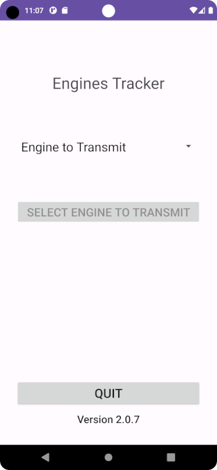
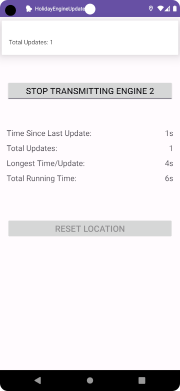

# Android Holiday Engine Location Updates


This is the Android Application that serves as the mobile component for the Holiday Engine tracker.  It sends updates to the Holiday Engine server, which records the location, time, and engine-id for that update. 

## Usage


### Required code/changes for use

To use this app as is the values that reside in the **`./constants/Constants.java`** class must be changed as appropriate.  The constants that require values are:

```java
    // used by LoginActivity.onClick(login_button), hard-coded password
    private static String password = "SHA-256 hash / 64-characters";

    // used by HolidayEngineUpdateActivity.onCreate(), returns number of engines from server, i.e. {"number":3}
    private static String enginesUrl = "";          // REST api path

    // used by TrackSantaService.onStartCommand().serverStartTracking(), tells server to start tracking and perform necessary housekeeping
    private static String startTrackingUrl = "";    // REST api path

    // used by TrackSantaService.onDestroy(), i.e. user has stopped tracking, stops server from tracking this engine, closes files/connections, etc.
    private static String stopTrackingUrl = "";     // REST api path

    // used by TrackSantaService.onLocationChanged(), updates current location with new coordinates
    private static String updateLocationUrl = "";   // REST api path
```

### Basic App Usage

Starting the app presents the user with a login page, and from there the **HolidayEngineUpdateActivity** is loaded.  This display presents the user with the option of which **Engine** to transmit location for, as well as the option of quitting.



Selecting an engine and confirming that choice takes you to the **TrackSantaActivity**, which presents a toggle button (default value off/not transmitting).  Pressing this toggle button will start the **`TrackSantaService`** transmitting the devices location.  Toggling the button off again will send a stop signal to the server, and stop transmitting.  This should reset the devices location to its starting point.




## Phones, Data Usage & Sim Cards

We found it easiest over time to have dedicated phones used for the task of running this app for the engine.  We typically use older / second-hand devices, and we have found that using an inexpensive plan like Tracfones' 500MB plan for under $18/line works perfectly.  If we could find a cheaper plan with less data we would use that instead.

Checking data usage after being in use for the full season (six routes typically per phone) less than 25MB was used, and that included data used by any other ancillary apps (have to do better at removing these) as well.  This was per the device management page on the Tracfone website.


## Current Tasks / Issues

1. Password for user login is currently a hard-coded hash value (SHA-256).
    1. Need to change this to have verified on server-side
    2. Will have to add REST call on server-side for this purpose
    3. Will have to create a mechanism to manage passwords (admin page of some type)
2. We seem to have issues with 1 of 3 devices (can change), and the app not persisting through a route (esp Android 9/10/+).  This has possibly been fixed through better permissions management, but it is still unclear.  Different devices appear to behave differently (related? - [https://dontkillmyapp.com/](https://dontkillmyapp.com/) ). 
    1. See notes in Backgrounds-Sleep inside of HolidayEngineUpdate2 directory.
    2. Additional [( BACKGROUND\.md )](BACKGROUND.md) notes.
3. ***minor***, the stats/progress counter continues to increment when tracking is stopped.

## Emulator & Simulated Location Updates

The emulator on Android Studio will take in either a GPX or a KML file to simulate GPS traveling.  There are apps that can create these files, or they can be created by hand. An example test file is located at **test-gpx.gpx** and **test2-gpx.gpx**.


## Additional Pages

- [Background Services](BACKGROUND.md)
- [Application Flow](APPFLOW.md)


